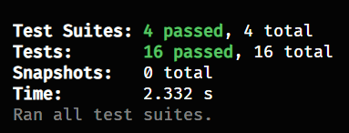

# Ponderada semana 03 - ZOO API

## Descrição da atividade

Criar uma API que deve permitir aos jogadores realizar as seguintes operações:

- Criação de Animais, tendo o mesmo nome, espécie e nível de felicidade.
- Criação de Recintos para abrigar os animais, contendo um ou mais animais da mesma espécie, sendo estes bem ou mal cuidados. Pense em funções para alterar os recintos.
- Alimentar os Animais, sendo que isso irá tornar os animais mais ou menos felizes.
- Receber visitantes - Esta função irá permitir que os jogadores ganhem dinheiro com base no número de visitantes que o zoológico atrai. Visitantes são atraídos por animais felizes e recintos bem cuidados.

Esta API deve ser desenvolvida utilizando a metodologia de desenvolvimento orientada a testes (TDD), realizando os respectivos testes unitários e testes de sistema finais da API.

## Estrutura de pastas

A organização do projeto foi feita da seguinte forma:

- `/classes`: Contém as classes que representam os objetos do sistema.
- `/tests`: Contém os testes unitários e de sistema.

## Testes realizados

Os testes realizados foram:

**1.Testes da Classe Animal:**

- Criação de Animal: Verifica se a instância do animal é criada com os valores corretos de nome, espécie e nível de felicidade.

- Método Alimentar: Testa se o método alimentar ajusta a felicidade do animal corretamente, aumentando, diminuindo ou mantendo conforme a quantidade de comida fornecida.

**2.Testes da Classe Recinto:**

- Criação de Recinto: Checa se o recinto é criado com a espécie correta e inicialmente vazio e bem cuidado.
Adição de Animais: Confirma se apenas animais da mesma espécie do recinto são adicionados, e se tentativas de adicionar animais de outras espécies são negadas.

- Alimentação de Animais: Testa se todos os animais no recinto são alimentados corretamente quando o método alimentarAnimais é invocado.

- Alteração de Condição: Verifica se a condição do recinto pode ser alterada entre 'bem cuidado' e 'mal cuidado' e se rejeita valores inválidos.

**3.Testes da Classe Zoológico:**

- Criação de Zoológico: Verifica se um novo zoológico começa sem recintos e sem caixa.

- Adição de Recintos: Testa se recintos podem ser adicionados ao zoológico e se são registrados corretamente.

- Cálculo de Felicidade Média: Avalia a precisão do cálculo da felicidade média dos animais no zoológico, incluindo cenários sem animais.

- Recepção de Visitantes: Testa se o zoológico calcula corretamente o número de visitantes e a receita com base na felicidade dos animais e na condição dos recintos.

**4.Teste de Sistema Completo:**

- Fluxo Operacional Completo: Executa um teste que simula um ciclo de operação completo do zoológico, incluindo a adição de recintos e animais, alimentação, mudanças de condição e recepção de visitantes, para garantir que todos os componentes do sistema funcionem harmoniosamente.

## Resultado dos testes

Os testes unitários e de sistema foram realizados com sucesso, conforme pode ser visto na imagem abaixo:

  

Além disso, os testes podem ser executados localmente com o comando `npm test`.	

*Para isso, antes é necessário rodar o comando `npm install` para instalar as dependências do projeto.*